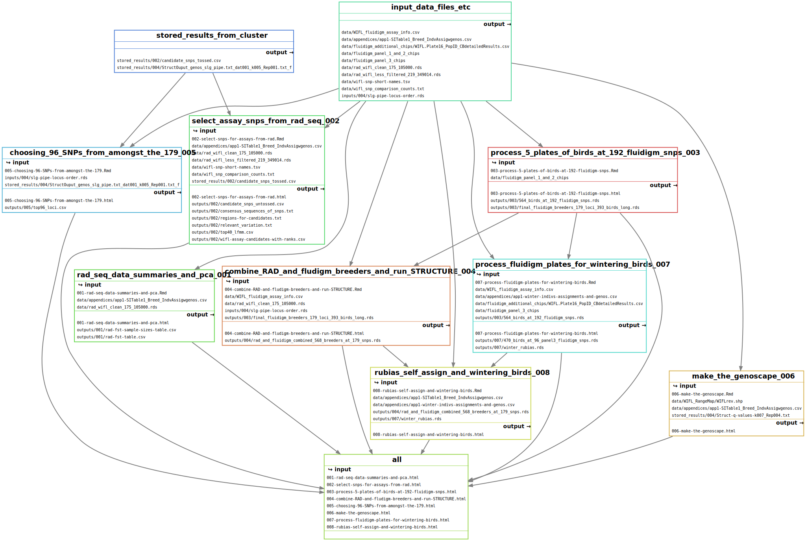

Ruegg et. al., WIFL Genoscape, Data and Code Repository
================
Kristen Ruegg, Eric C. Anderson, Marius Somvielle, Rachael A. Bay,
Christen Bossu, Mary Whitfield, Eben H. Paxton, Thomas B. Smith

  - [Overview](#overview)
  - [Preliminaries and Dependencies](#preliminaries-and-dependencies)
      - [Unix Programs](#unix-programs)
      - [Genomic resources](#genomic-resources)
      - [Geospatial data](#geospatial-data)
      - [Climate Data](#climate-data)
      - [R Packages](#r-packages)
  - [RMarkdown Documents and R
    Scripts](#rmarkdown-documents-and-r-scripts)
      - [001-rad-seq-data-summaries-and-pca.Rmd](#rad-seq-data-summaries-and-pca.rmd)
      - [002-select-snps-for-assays-from-rad.Rmd](#select-snps-for-assays-from-rad.rmd)
      - [003-process-5-plates-of-birds-at-192-fluidigm-snps.Rmd](#process-5-plates-of-birds-at-192-fluidigm-snps.rmd)
      - [004-combine-RAD-and-fludigm-breeders-and-run-STRUCTURE.Rmd](#combine-rad-and-fludigm-breeders-and-run-structure.rmd)
      - [005-choosing-96-SNPs-from-amongst-the-179.Rmd](#choosing-96-snps-from-amongst-the-179.rmd)
      - [006-make-the-genoscape.Rmd](#make-the-genoscape.rmd)
      - [007-process-fluidigm-plates-for-wintering-birds.Rmd](#process-fluidigm-plates-for-wintering-birds.rmd)
      - [008-rubias-self-assign-and-wintering-birds.Rmd](#rubias-self-assign-and-wintering-birds.rmd)
      - [101-niche\_tracking\_analysis.R](#niche_tracking_analysis.r)
  - [Snakemake](#snakemake)
  - [Literature Cited](#literature-cited)

[](https://zenodo.org/badge/latestdoi/297655089)

**Last Updated:** 2021-04-01

# Overview

This repository includes code, data, and some intermediate results to
reproduce the results in Ruegg et al. (“Seasonal niche breadth predicts
population declines in a long-distance migratory bird”). You can get the
whole thing by cloning or downloading the repo from
<https://github.com/eriqande/ruegg-et-al-wifl-genoscape>.

If you are viewing this as the README of a GitHub repository, note that
you can read it in a somewhat friendlier format (i.e., with a table of
contents, etc.) on GitHub pages at:
<https://eriqande.github.io/ruegg-et-al-wifl-genoscape/>

RAD sequening and the production of BAMs and VCFs was described and
documented in Ruegg et al. (2018). The work described in this repository
uses the products from that work

The various steps in our analyses are described in a series of RMarkdown
documents with a fair bit of explanation/description of the procedures.
The few analyses that used cluster computing resources are described and
documented, but results from those analyses are included in
`stored_results` so that it is not necessary to have access to a cluster
to reproduce the results herein.

Running some of the RMarkdown documents requires a proper shell. These
were initially developed and run on a Mac.

Rmarkdown documents and scripts in the 000 series were developed
primarily by Eric C. Anderson. Rmarkdown documents and scripts in the
100 series were developed primarily by Marius Somveille.

All the RMarkdown documents or scripts can be evaluated en masse by
sourcing the R script `render-numbered-Rmds-and-scripts.R`. On a fairly
old mac laptop the run times for each are as follows:

    ## # A tibble: 9 x 2
    ##   File                                                  `Running time in HH:MM:…
    ##   <chr>                                                 <chr>                   
    ## 1 001-rad-seq-data-summaries-and-pca.Rmd                00:00:59                
    ## 2 002-select-snps-for-assays-from-rad.Rmd               00:00:45                
    ## 3 003-process-5-plates-of-birds-at-192-fluidigm-snps.R… 00:00:10                
    ## 4 004-combine-RAD-and-fludigm-breeders-and-run-STRUCTU… 00:00:12                
    ## 5 005-choosing-96-SNPs-from-amongst-the-179.Rmd         00:00:05                
    ## 6 006-make-the-genoscape.Rmd                            00:02:55                
    ## 7 007-process-fluidigm-plates-for-wintering-birds.Rmd   00:00:10                
    ## 8 008-rubias-self-assign-and-wintering-birds.Rmd        00:00:11                
    ## 9 101-niche_tracking_analysis.R                         07:57:38

# Preliminaries and Dependencies

Below is a description of the needed dependencies. A script to install
all of them on one of our test clusters is at
`000-00-prepare-dependencies.sh` (NOT YET INCLUDED), but it may likely
need some tweaking on your system.

## Unix Programs

The following programs must be installed and available in the PATH.
Versions used on Eric’s laptop appear in parentheses. (NOT COMPLETE YET)

  - `bgzip`:
  - `samtools`:
  - `tabix`:

## Genomic resources

Create a directory in the top level of the repository, download the
willow flycatcher then modify the sequence names to be consistent with
the nomenclature used in this work and index the genome (that
nomenclature is already in in the FASTA file, but just not as the
sequence name so, we need to only shift some words around on each
sequence name line).

``` sh
mkdir genome
cd genome/
wget ftp://ftp.ncbi.nlm.nih.gov/genomes/genbank/vertebrate_other/Empidonax_traillii/latest_assembly_versions/GCA_003031625.1_ASM303162v1/GCA_003031625.1_ASM303162v1_genomic.fna.gz
ftp://ftp.ncbi.nlm.nih.gov/genomes/genbank/vertebrate_other/Empidonax_traillii/latest_assembly_versions/GCA_003031625.1_ASM303162v1/GCA_003031625.1_ASM303162v1_assembly_report.txt

# now, change the sequence names and make sure that the DNA bases
# are all listed in UPPERCASE.
gzcat GCA_003031625.1_ASM303162v1_genomic.fna.gz | awk '
  /^>/ {
    tmp = substr($1, 2)
    newname = $6
    sub(/,/, "", newname)
    sub(/:/, "|", newname)
    $1 = ">" newname;
    $6 = tmp ",";
    print
    next
  }
  {print toupper($0)}
' > wifl-genome.fna
samtools faidx wifl-genome.fna
```

## Geospatial data

Make a directory in the top level of the repository called `geo-spatial`
and then download some large files from Natural Earth Data to there:

  - We the hypsometrically tinted Natural Earth map with water bodies
    and rivers on it, and you might as well get the one that has some
    ocean basin coloring too. Natural Earth II with Shaded Relief,
    Water, and Drainages raster
    <https://www.naturalearthdata.com/http//www.naturalearthdata.com/download/10m/raster/HYP_HR_SR_OB_DR.zip>.
    Put or symlink the resulting directory, `HYP_HR_SR_OB_DR` into
    `geo-spatial`.
  - 10m-cultural-vectors, Admin 1 – States, Provinces, Download boundary
    lines:
    <https://www.naturalearthdata.com/http//www.naturalearthdata.com/download/10m/cultural/ne_10m_admin_1_states_provinces_lines.zip>.
    Put the resulting directory, `ne_10m_admin_1_states_provinces_lines`
    into `geo-spatial`.
  - Finally, get the coastlines:
    <https://www.naturalearthdata.com/http//www.naturalearthdata.com/download/10m/physical/ne_10m_coastline.zip>,
    and put the resulting folder, `ne_10m_coastline` into `geo-spatial`.

Here is some R-code that would make that all happen:

``` r
dir.create("geo-spatial", showWarnings = FALSE)

# Natural Earth Data rasters
tmpfile <- tempfile()
downloader::download(
  url = "https://www.naturalearthdata.com/http//www.naturalearthdata.com/download/10m/raster/HYP_HR_SR_OB_DR.zip",
  dest = tmpfile
)
unzip(zipfile = tmpfile, exdir = "geo-spatial/HYP_HR_SR_OB_DR")


# coastlines
tmpfile <- tempfile()
downloader::download(
  url = "https://www.naturalearthdata.com/http//www.naturalearthdata.com/download/10m/physical/ne_10m_coastline.zip",
  dest = tmpfile
)
unzip(zipfile = tmpfile, exdir = "geo-spatial/ne_10m_coastline")


# country boundaries
tmpfile <- tempfile()
downloader::download(
  url = "https://www.naturalearthdata.com/http//www.naturalearthdata.com/download/10m/cultural/ne_10m_admin_0_boundary_lines_land.zip",
  dest = tmpfile
)
unzip(zipfile = tmpfile, exdir = "geo-spatial/ne_10m_admin_0_boundary_lines_land")


# state and province boundaries
# country boundaries
tmpfile <- tempfile()
downloader::download(
  url = "https://www.naturalearthdata.com/http//www.naturalearthdata.com/download/10m/cultural/ne_10m_admin_1_states_provinces_lines.zip",
  dest = tmpfile
)
unzip(zipfile = tmpfile, exdir = "geo-spatial/ne_10m_admin_1_states_provinces_lines")
```

## Climate Data

Make a directory in the top level of the repository called
`Climate-data`. Change into that directory and download the average
temperature and precipitation at 2.5 minutes resolution from WorldClim
<https://worldclim.org/data/worldclim21.html>. Unzip the downloads
within `Climate-data`. Depending on the method used to unzip things,
this might leave you with the directories `wc2.1_2.5m_tavg` and
`wc2.1_2.5m_prec`. Or it might not. The important thing is that you want
all the actual tif files to be placed immediately within the
`Climate-data` directory. So, you might have to move all of those files
out of `wc2.1_2.5m_tavg` and `wc2.1_2.5m_prec`.

``` sh
mkdir Climate-data
cd Climate-data
wget http://biogeo.ucdavis.edu/data/worldclim/v2.1/base/wc2.1_2.5m_tavg.zip
wget http://biogeo.ucdavis.edu/data/worldclim/v2.1/base/wc2.1_2.5m_prec.zip
unzip wc2.1_2.5m_tavg.zip
unzip wc2.1_2.5m_prec.zip
rm -f wc2.1_2.5m_tavg.zip
rm -f wc2.1_2.5m_prec.zip
mv wc2.1_2.5m_tavg/* wc2.1_2.5m_prec/* ./
rmdir wc2.1_2.5m_tavg wc2.1_2.5m_prec
cd ../
```

Note, when done with this, the listing of the `Climate-data` directory
looks like:

``` sh
# ls Climate-data/*
Climate-data/readme.txt*             Climate-data/wc2.1_2.5m_prec_09.tif  Climate-data/wc2.1_2.5m_tavg_06.tif
Climate-data/wc2.1_2.5m_prec_01.tif  Climate-data/wc2.1_2.5m_prec_10.tif  Climate-data/wc2.1_2.5m_tavg_07.tif
Climate-data/wc2.1_2.5m_prec_02.tif  Climate-data/wc2.1_2.5m_prec_11.tif  Climate-data/wc2.1_2.5m_tavg_08.tif
Climate-data/wc2.1_2.5m_prec_03.tif  Climate-data/wc2.1_2.5m_prec_12.tif  Climate-data/wc2.1_2.5m_tavg_09.tif
Climate-data/wc2.1_2.5m_prec_04.tif  Climate-data/wc2.1_2.5m_tavg_01.tif  Climate-data/wc2.1_2.5m_tavg_10.tif
Climate-data/wc2.1_2.5m_prec_05.tif  Climate-data/wc2.1_2.5m_tavg_02.tif  Climate-data/wc2.1_2.5m_tavg_11.tif
Climate-data/wc2.1_2.5m_prec_06.tif  Climate-data/wc2.1_2.5m_tavg_03.tif  Climate-data/wc2.1_2.5m_tavg_12.tif
Climate-data/wc2.1_2.5m_prec_07.tif  Climate-data/wc2.1_2.5m_tavg_04.tif
Climate-data/wc2.1_2.5m_prec_08.tif  Climate-data/wc2.1_2.5m_tavg_05.tif
```

## R Packages

Packages must be downloaded from CRAN, BioConductor, and GitHub. The
following code, which is in `R/install_packages_etc.R`, will download
and install the necessary packages:

``` r
# just R code to install the packages needed for running the notebooks

# Note: on 2021-03-29 I found that dggrid had been removed from CRAN.
# But old versions (we installed 2.0.4) are archived and can be installed instead.

# get the packages needed from CRAN
install.packages(
  c(
    "ade4",
    "car",
    "dggridR",
    "downloader",
    "ebirdst",
    "ecospat",
    "emdist",
    "fields",
    "geosphere",
    "ggspatial",
    "gridExtra",
    "hms",
    "igraph",
    "inlabru",
    "knitr",
    "lubridate",
    "mapplots",
    "MASS",
    "move",
    "raster",
    "RColorBrewer",
    "reticulate",
    "rgeos",
    "rmarkdown",
    "rnaturalearth",
    "rnaturalearthdata",
    "rubias",
    "rworldmap",
    "sessioninfo",
    "sf",
    "sp",
    "tidyverse"
  ),
  repos = "http://cran.rstudio.com"
)

# Install packages from BioConductor
if (!requireNamespace("BiocManager", quietly = TRUE))
  install.packages("BiocManager")

BiocManager::install("SNPRelate")


# Install Eric's Packages from GitHub
# These include the specific commit (ref) used
remotes::install_github("eriqande/genoscapeRtools", ref = "3e1dbfc0")
remotes::install_github("eriqande/snps2assays", ref = "8666f066")
remotes::install_github("eriqande/whoa", ref = "dddbeead")
remotes::install_github("eriqande/TESS3_encho_sen", ref = "2a0ce6c6")  # for special version of tess3r
```

# RMarkdown Documents and R Scripts

The following RMarkdown documents should be evaluated in order. The
script `render-numbered-Rmds-and-scripts.R` will do that when run in the
top level of this repository. Some RMarkdown documents and R scripts
rely on outputs from previous ones. Some of these RMarkdown documents
include calls to Unix utilities, so might not run on non-Unix or
non-Linux architectures.

Outputs (figures, tables, R data objects, etc) from each RMarkdown
document are written to the `outputs/XXX` directories.  
To facilitate working between the cluster and a desktop/laptop, some
outputs are written to the `stored_results/XXX` directories which are
version controlled and included in this repo.

## 001-rad-seq-data-summaries-and-pca.Rmd

(*Compiled RMarkdown HTML document on GitHub Pages:*
[001-rad-seq-data-summaries-and-pca.html](https://eriqande.github.io/ruegg-et-al-wifl-genoscape/001-rad-seq-data-summaries-and-pca.html))

Summarizing the RAD seq data, filtering out obvious paralogs and
monomorphic sites, then producing a PCA plot and estimates of pairwise
\(F_\mathrm{ST}\).

## 002-select-snps-for-assays-from-rad.Rmd

(*Compiled RMarkdown HTML document on GitHub Pages:*
[002-select-snps-for-assays-from-rad.html](https://eriqande.github.io/ruegg-et-al-wifl-genoscape/002-select-snps-for-assays-from-rad.html))

All the steps we went through to rank the RAD-genotyped SNPs for ability
to resolve different populations/subspecies, and then the workflow for
designing Fluidigm assays from them.

## 003-process-5-plates-of-birds-at-192-fluidigm-snps.Rmd

(*Compiled RMarkdown HTML document on GitHub Pages:*
[003-process-5-plates-of-birds-at-192-fluidigm-snps.html](https://eriqande.github.io/ruegg-et-al-wifl-genoscape/003-process-5-plates-of-birds-at-192-fluidigm-snps.html))

Workflow for processing 5 plates of breeding birds typed on two plates
of Fluidigm assays. Filtering out the SNPs with high missing rate.
Naming alleles in various ways for downstream workflows, attaching
additional meta data for birds and markers.

## 004-combine-RAD-and-fludigm-breeders-and-run-STRUCTURE.Rmd

(*Compiled RMarkdown HTML document on GitHub Pages:*
[004-combine-RAD-and-fludigm-breeders-and-run-STRUCTURE.html](https://eriqande.github.io/ruegg-et-al-wifl-genoscape/004-combine-RAD-and-fludigm-breeders-and-run-STRUCTURE.html))

Take the 012 file of RAD data from Ruegg et al. (2018) and reconstitute
the actual alleles (bases) at those sites so as to make the data
commensurate with the newly typed Fluidigm assays from 003. Then combine
the Fluidigm and RAD data to run all the breeding birds through
STRUCTURE.

## 005-choosing-96-SNPs-from-amongst-the-179.Rmd

(*Compiled RMarkdown HTML document on GitHub Pages:*
[005-choosing-96-SNPs-from-amongst-the-179.html](https://eriqande.github.io/ruegg-et-al-wifl-genoscape/005-choosing-96-SNPs-from-amongst-the-179.html))

Whittle the 179 Fluidigm assays down to a panel of 96 with which to type
the wintering birds and assign them to different regions/clusters.

## 006-make-the-genoscape.Rmd

(*Compiled RMarkdown HTML document on GitHub Pages:*
[006-make-the-genoscape.html](https://eriqande.github.io/ruegg-et-al-wifl-genoscape/006-make-the-genoscape.html))

From the Q-values resulting from running STRUCTURE on the 179 Fluidigm
assays typed upon breeding birds of known geographic location (and the
genotypes of the RAD-sequenced birds at the same genomic sites), create
the “genoscape” for WIFL, and then show how to make a pretty map out of
it.

## 007-process-fluidigm-plates-for-wintering-birds.Rmd

(*Compiled RMarkdown HTML document on GitHub Pages:*
[007-process-fluidigm-plates-for-wintering-birds.html](https://eriqande.github.io/ruegg-et-al-wifl-genoscape/007-process-fluidigm-plates-for-wintering-birds.html))

Process the wintering birds typed at the 96 Fluidigm assays chosen for
wintering bird assignment.

## 008-rubias-self-assign-and-wintering-birds.Rmd

(*Compiled RMarkdown HTML document on GitHub Pages:*
[008-rubias-self-assign-and-wintering-birds.html](https://eriqande.github.io/ruegg-et-al-wifl-genoscape/008-rubias-self-assign-and-wintering-birds.html))

Self-assignment (leave-one-out cross-validation) of the reference
(breeding) birds, and mixture analysis of the wintering birds.

## 101-niche\_tracking\_analysis.R

(*Source code of the R script viewable on Github at:*
[101-niche\_tracking\_analysis.R](https://github.com/eriqande/ruegg-et-al-wifl-genoscape/blob/master/101-niche_tracking_analysis.R))

R script that does the entire niche-tracking analysis.

# Snakemake

For those of a snakemake persuasion, there is a Snakefile included in
this that will let you evaluate all the numbered RMarkdown documents and
numbered R scripts with a simple:

``` sh
snakemake --cores 8
```

assuming you have 8 cores to play with.

The input and output file dependencies between those numbered RMarkdown
docs and R scripts is shown here (from `snakemake --filegraph | dot
-Tsvg > filegraph.svg`)



# Literature Cited

<div id="refs" class="references">

<div id="ref-ruegg2018ecological">

Ruegg, Kristen, Rachael A Bay, Eric C Anderson, James F Saracco, Ryan J
Harrigan, Mary Whitfield, Eben H Paxton, and Thomas B Smith. 2018.
“Ecological Genomics Predicts Climate Vulnerability in an Endangered
Southwestern Songbird.” *Ecology Letters* 21 (7): 1085–96.

</div>

</div>
